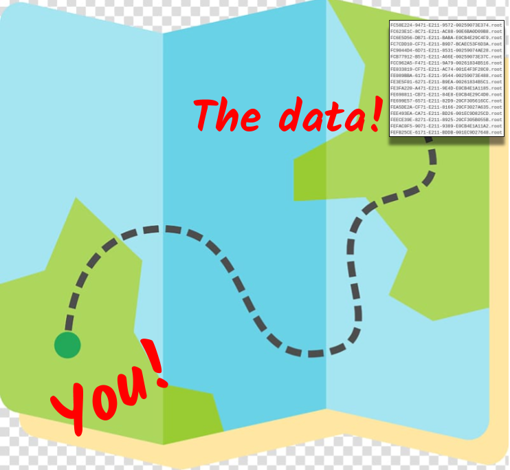

<!-- this is an html comment -->

This lesson is designed to teach you how to explore available CMS datasets on the CERN Open Data portal. 
In this way, you can see in which primary datasets collision data were directed 
when the data were taken and what Monte Carlo samples are available for the run period
you are interested in.

You'll also be shown how to do a first-order inspection of some of these datafiles, just to see
what is stored in them.

 This is a comment in Liquid 


